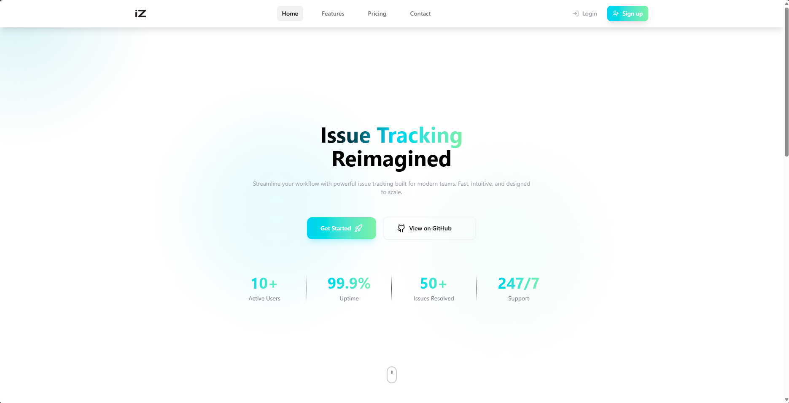

# Issue Tracker (CRUD)



A full-stack Issue Tracker web app with authentication + Issue CRUD (Create / Read / Update / Delete), search/filter, and export.

## Live Demo
- Frontend: https://issue-tracker-steel-two.vercel.app  
- Backend: https://issue-tracker-backend-hpyn.onrender.com  

## Test Credentials
- Email: **user@user.com**
- Password: **user1234**

## Full Documentation (PDF)
See: **docs/info/Issue-Tracker-Project-Documentation.pdf**

---

## Local Setup (Run on your machine)

### 1) Clone
```bash
git clone https://github.com/MalithGihan/issue-tracker
cd issue-tracker
```

### 2) Backend (server)
Create `server/.env`:
```env
MONGO_URI=your_mongodb_uri
CLIENT_ORIGIN=http://localhost:5173
SERVER_PORT=4000

JWT_ACCESS_SECRET=your_access_secret # Make a random string
JWT_REFRESH_SECRET=your_refresh_secret # Make a random string
ACCESS_MINUTES=15
REFRESH_DAYS=7

COOKIE_SECURE=false
COOKIE_SAMESITE=lax
NODE_ENV=development
```

Run:
```bash
cd server
npm install
npm run dev
```

Health check:
- http://localhost:4000/api/health

### 3) Frontend (client)
Create `client/.env.local`:
```env
VITE_API_BASE_URL=http://localhost:4000
```

Run:
```bash
cd client
npm install
npm run dev
```

Open:
- http://localhost:5173

---

## Deployment Notes
- Backend hosted on **Render**
- Frontend hosted on **Vercel**

---

### 4) Tech Stack & Libraries

## Frontend
-React + TypeScript (Vite)
-React Router
-Tailwind CSS
-Redux Toolkit + RTK Query (API + caching)
-Formik + Yup / Zod (forms + validation)
-react-hot-toast (notifications)
-lucide-react (icons)
-Drag & Drop for Kanban (your library name here)

## Backend
-Node.js + Express + TypeScript
-MongoDB + Mongoose
-Auth: JWT (Access/Refresh) in HttpOnly Cookies
-Security: Helmet, CORS, rate limiting, HPP, mongo-sanitize, CSRF guard
-Logging: Pino (and/or request logging middleware)
-Monitoring: Prometheus metrics endpoint + Grafana dashboards

---

If you get **404 on refresh** (example: `/login`), configure a Vercel SPA rewrite (see PDF).

If login works on desktop but not on **real iPhone**, use an **API proxy rewrite** on Vercel so cookies become **first-party** (see PDF).
